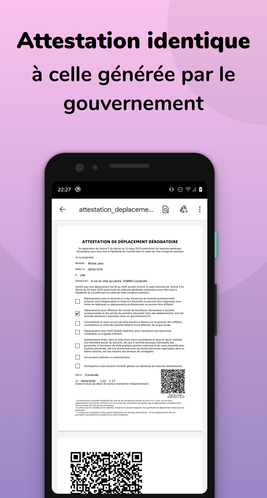
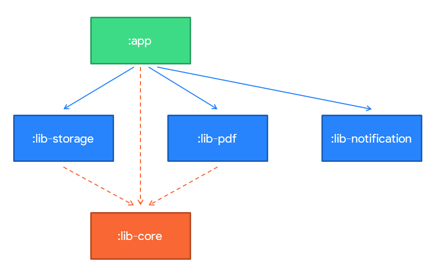

# android-covid19-pdf
🏠 *On est confinés.*

### Contexte
Cette application Android a pour but de permettre la génération du PDF d'attestation de déplacement dérogatoire en France face à l'épidémie de Covid19.

Elle permet de générer un PDF avec :
* les informations relatives à l'utilisateur et à son déplacement
* le QRCode au même format que celui généré sur le site officiel du gouvernement

 ### Installer l'application

Les sources sont disponibles ici si vous voulez la déployer depuis Android Studio.

Aussi, **le fichier APK d'installation est disponible sur la page [releases](https://github.com/BapNesS/android-covid19-pdf/releases)** de ce repository.

### Liens utiles
 * **[Générateur d'attestation numérique du gouvernement](https://media.interieur.gouv.fr/deplacement-covid-19/)**
* [androidmads/QRGenerator](https://github.com/androidmads/QRGenerator)

## Fonctionnalités
✅ Formulaire de saisie

✅ Génération de PDF avec QRCode

✅ L'accès au dernier PDF généré sur l'accueil et en notification

✅ Case à cocher dans le formulaire : *conserver mes informations d'identification sur le téléphone*. Cela permet de pré-remplir le formulaire et de ne resaisir que le motif de la sortie.

✅ Suppression des informations stockées dans les préférences

✅ Trois raccourcis sur l'icône pour accéder plus rapidement aux fonctionnalités : nouveau formulaire, dernier PDF géré, préférences

### Détails
Pour le PDF, le **document officiel** est pris et **une page blanche pour le QRCode** est ajoutée.

Le formulaire est **horodaté à la date de génération**. Le lieu correspond au lieu de résidence de l'utilisateur. (cf formulaire officiel en ligne)

Le QRCode généré est le même que sur le PDF généré via le formulaire officiel en ligne.

**Le formulaire est pré-rempli**. L'utilisateur a la possibilité de modifier les infos dans le formulaire.

## Visuel

| | Captures | |
| ------------- |:-------------:| -----:|
|  |  |  |

## Architecture

### Librairies utilisées

* Android Mads QRGenerator
* Android X Constraint Layout
* Android X AppCompat
* Android X Core
* Android X Lifecycle
* Android X Navigation
* Android X Preference
* Google Zxing core
* Google Material Components
* Kenglxn QRGen
* Kotlin Coroutines
* Timber

## Contributeurs
* [Antoine Robiez](https://github.com/enthuan)
* [Baptiste Carlier](https://github.com/enthuan)
